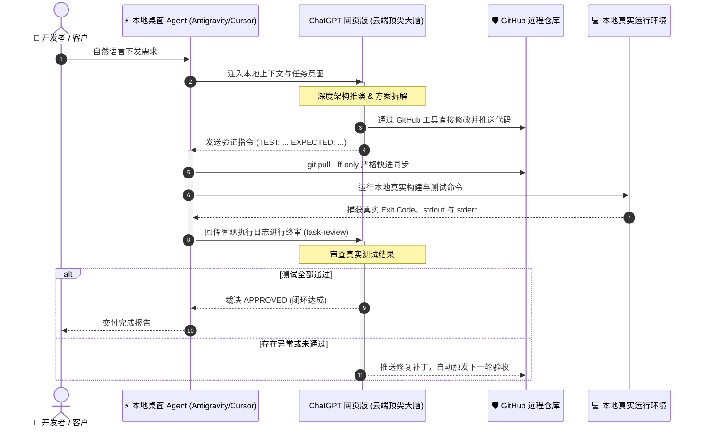

<div align="center">

# 🤖 Antigravity2gptweb
### 纯自然语言驱动的通用“双脑”AI 协作开发桥梁
**Desktop Agent × ChatGPT 网页版 (GPT 5.6 SOL / GPT 6.0 Astra) × GitHub 全自动闭环**

<br/>

[](LICENSE)
[](https://yvochehk-oss.github.io/Antigravity2gptweb/)
[](https://github.com/yvochehk-oss/Antigravity2gptweb/releases/tag/v1.1.0)
[](https://yvochehk-oss.github.io/Antigravity2gptweb/#download)
[](#-单元测试与架构终审)
[](#-平台支持与跨平台安装)
[](#-安装到-antigravity-ide)
[](#-双脑协作架构与执行时序)
[](#-安全合规与隐私保障)
[](https://github.com/users/yvochehk-oss/projects/2/views/1)
[](https://github.com/yvochehk-oss/Antigravity2gptweb)

<br/>

<p align="center">
  <a href="https://yvochehk-oss.github.io/Antigravity2gptweb/"><b>🌐 访问产品官方首页</b></a> •
  <a href="https://yvochehk-oss.github.io/Antigravity2gptweb/#download"><b>📥 前往官方极速下载中心</b></a> •
  <a href="#-核心价值与痛点解决">核心价值</a> •
  <a href="#-双脑协作架构与执行时序">架构原理</a> •
  <a href="#-browser-skill-bsk-驱动加固特性-v110">v1.1.0 特性</a> •
  <a href="#-平台支持与跨平台安装">跨平台安装</a> •
  <a href="#-安装到-antigravity-ide">Antigravity 集成</a> •
  <a href="#-单元测试与架构终审">测试与终审</a> •
  <a href="#-安全合规与隐私保障">安全保障</a> •
  <a href="#-实时研发看板-live-roadmap">项目看板</a>
</p>

</div>

---

> 🌟 **项目默认入口与官方网站**：👉 [**https://yvochehk-oss.github.io/Antigravity2gptweb/**](https://yvochehk-oss.github.io/Antigravity2gptweb/)  
> 📥 **官方极速下载与安装中心**：👉 [**https://yvochehk-oss.github.io/Antigravity2gptweb/#download**](https://yvochehk-oss.github.io/Antigravity2gptweb/#download)  
> 包含深色高颜值双脑协作演示、多平台一键免安装下载包、实时产品交付大屏 (Issue #1~#9) 与一键挂载指令！

---

> **一句话愿景**：告别在网页端与代码编辑器之间繁琐的“复制、粘贴、运行、报错、再复制”。你只需在聊天框里用平常说话的自然语言描述需求，桌面 AI Agent 即可自动直连 ChatGPT 网页端顶尖大模型（GPT 5.6 SOL / GPT 6.0 Astra），完成**云端架构推演、GitHub 远端修改提交、本地确定性快速拉取与闭环测试验收**！

---

## 📥 极速下载与安装中心

本项目分为 **两大核心版本系列**，均提供预打包免配置 ZIP 安装包与 Git 快捷部署，点击即可前往官网下载大屏：

> 🚀 **官方可视化下载大屏**：👉 [**https://yvochehk-oss.github.io/Antigravity2gptweb/#download**](https://yvochehk-oss.github.io/Antigravity2gptweb/#download)

### 1️⃣ Browser-Skill 扩展驱动版（v1.1.0 发行版 · 日常推荐）
> 适用场景：日常使用已登录的 Chrome / Edge 浏览器，免开 9222 调试端口，具备独立副驾窗口（--no-focus，零抢占焦点）与风控人工唤醒能力。

| 平台通道 | 官网下载入口 / 备用直链 | 核心组件与特性 |
| :--- | :--- | :--- |
| 🍏 **macOS 版 (v1.1.0)** | [**📥 前往官网下载 macOS 增强版**](https://yvochehk-oss.github.io/Antigravity2gptweb/#download-bsk) <br/><sub>[备用直链 (.zip)](https://github.com/yvochehk-oss/Antigravity2gptweb/archive/refs/heads/macos.zip)</sub> | Browser-Skill (`bsk`) 免端口直连、Python CDP 桥接、POSIX fcntl 锁、18 项全量测试通过 |
| 🪟 **Windows 版 (v1.1.0)** | [**📥 前往官网下载 Windows 增强版**](https://yvochehk-oss.github.io/Antigravity2gptweb/#download-bsk) <br/><sub>[备用直链 (.zip)](https://github.com/yvochehk-oss/Antigravity2gptweb/archive/refs/heads/windows.zip)</sub> | Browser-Skill (`bsk`) 直连日常 Edge/Chrome、Windows msvcrt 锁与环境自检、18 项测试全过 |

### 2️⃣ 系统原生直连版（Native Engine · 0 外部依赖）
> 适用场景：追求极致轻量、0 外部浏览器扩展、0 npm 依赖包的极简纯净开发者，系统底层原生直连。

| 平台通道 | 官网下载入口 / 备用直链 | 核心组件与特性 |
| :--- | :--- | :--- |
| 🍏 **macOS 原生版** | [**📥 前往官网下载 macOS 原生版**](https://yvochehk-oss.github.io/Antigravity2gptweb/#download-native) <br/><sub>[备用直链 (.zip)](https://github.com/yvochehk-oss/Antigravity2gptweb/archive/refs/heads/macos.zip)</sub> | 纯 Safari 原生 AppleScript 驱动，系统自带 0 扩展依赖，开箱即用 |
| 🪟 **Windows 原生版** | [**📥 前往官网下载 Windows 原生版**](https://yvochehk-oss.github.io/Antigravity2gptweb/#download-native) <br/><sub>[备用直链 (.zip)](https://github.com/yvochehk-oss/Antigravity2gptweb/archive/refs/heads/windows.zip)</sub> | 纯原生 Node.js 18+ 驱动引擎（**0 个 npm 依赖包**），毫秒级独立自洽启动 |

> 🏷️ **源码与发行说明**：[Releases v1.1.0 官方发行页](https://github.com/yvochehk-oss/Antigravity2gptweb/releases/tag/v1.1.0) \| [下载全量源码包 (.zip)](https://github.com/yvochehk-oss/Antigravity2gptweb/archive/refs/tags/v1.1.0.zip)

---

## 💡 核心价值与痛点解决

过去使用 AI 辅助软件开发或交付项目时，经常面临效率瓶颈：
- 🤯 **思路卡壳 / 架构复杂**：遇到疑难复杂问题不知道如何拆解，需要顶级的深度思考模型（如 GPT 5.6 SOL / GPT 6.0 Astra）来全局指导。
- 😫 **频繁复制极其痛苦**：在 ChatGPT 网页端和本地编辑器之间来回“复制、粘贴、运行、报错、再发回提问”，费时费力且容易出错。
- 💸 **API 账单居高不下**：调用外部 API 不仅上下文计费昂贵，还经常受限于速率上限（Rate Limits）。
- 😨 **改动失控难以挽回**：AI 一次性修改了多个文件导致项目跑不通，找不到原始版本，不知如何优雅回滚。

### 痛点对比一览表

| 维度 | 传统手工 / 纯本地 AI 模式 | 🤖 Antigravity2gptweb 双脑协作模式 |
| :--- | :--- | :--- |
| **交互方式** | 手动在网页与 IDE 间来回搬运代码 | **纯自然语言下发**，全流程自动化闭环 |
| **推理成本** | 昂贵的商业 API 计费、Token 消耗极快 | **零额外 API 成本**，充分复用已有的 ChatGPT Plus/Team 网页订阅 |
| **代码可靠性** | 本地模型经常“幻觉伪造”，改完报错 | **严格闭环验收**：本地真实跑测，GPT 裁决 `APPROVED` 方可交付 |
| **版本安全** | 容易直接覆盖本地代码，改错无法恢复 | **GitHub 严格护栏**：强制原子化提交与 Fast-Forward，随时一键回滚 |

---

## 👥 双脑协作架构与执行时序

本项目采用创新的 **双平面隔离架构 (Dual-Plane Architecture)**：将“思考与代码修改权”交给云端大模型，将“确定性测试与客观证据收集”交给本地桌面环境。

### 协作流程图



### 角色分工与执行铁律

| 角色 | 核心职责 | 行为边界（严禁越位） | 带来的好处 |
| :--- | :--- | :--- | :--- |
| 🧠 **ChatGPT 网页版**<br>*(云端总架构师)* | 负责深度逻辑推演、方案拆解、**通过 GitHub 工具修改、提交和推送业务代码**、提供测试命令与审核测试结果 | 仅操作用户授权的远程仓库与分支，独占方案与代码修改权 | 借助网页端顶尖推理能力，保证全局架构与业务代码的高水准 |
| ⚡ **本地桌面 Agent**<br>*(精准验收执行端)* | 负责提取环境上下文、`git pull --ff-only` 同步远端提交、运行真实测试命令、将测试日志回传 GPT 审查 | **严禁越俎代庖编写或覆盖本地业务代码**；工作区有未提交变动时必须停止同步 | 用真实环境提供可复核的客观证据，彻底杜绝 AI 幻觉和瞎编 |
| 🛡️ **GitHub 仓库**<br>*(版本安全管家)* | 自动记录每一次变动，保留完整历史 | 任何一次改动都具备原子化 Commit，改错了随时一键撤销 | 历史透明可追溯，保障企业级代码资产绝对安全 |

---

## 🚀 Browser-Skill (`bsk`) 驱动加固特性 (v1.1.0)

针对企业与客户在生产环境中的深度体验，v1.1.0 引入了重大加固与闭环保护机制：

1. **默认独立 Agent Window 副驾模式**：
   - 彻底废弃对用户日常主窗口的强行抢占，默认以 `--no-focus` 在独立 Agent Window 标签中静默运行；
   - 100% 保持操作系统焦点留在当前编辑器中，日常工作不受任何打断，且彻底消除了 Chrome 顶部醒目的黄色调试提示条。
2. **多 Browser Profile 明确选择与防串号安全保护 (Fail-Closed)**：
   - 支持通过 `--list-browser-profiles` 枚举所有在线浏览器 Profile 实例；
   - 支持通过 `--browser-profile <instance_id|label>` 精准绑定工作环境；
   - 单 Profile 自动适配；检测到多 Profile 未显式指定时**严格拦截（Fail-Closed）**，绝不进行模糊猜测。
3. **React 水合状态检测与原生 CDP 点击**：
   - 严格等待编辑器水合就绪（`isContentEditable === true`）；
   - 通过原生 CDP 物理点击 `button[data-testid="send-button"]`，彻底解决 ProseMirror 多行长文本误插入换行的问题；
   - 提交成功判据为“DOM 中实际出现匹配预期内容的 User 消息节点”，绝非仅依赖按键事件返回。
4. **跨平台 P0 级文件锁与状态隔离**：
   - POSIX / macOS 平台使用 `fcntl.flock`；
   - Windows 原生平台使用 `msvcrt.locking`；
   - 锁文件统一存放于 `tempfile.gettempdir()`，生命周期由操作系统内核管理，进程异常中断自动释放，彻底避免死锁。
5. **人机验证 (Cloudflare / CAPTCHA) 防假阳性自愈**：
   - 唤醒 `bsk request-help` 提示用户验证，强制校验 JSON 返回值；
   - 仅当 `outcome` 为 `continued` 或 `completed` 时方可继续；若遇取消或超时则安全熔断。
6. **增强型凭据脱敏**：
   - 过滤覆盖 Cookie、Authorization、Basic Auth、带用户名密码的 URI，全面守护企业资产。

---

## 📦 平台支持与跨平台安装

本项目采用**平台专项分支发布**模式：`main` 分支作为公开统一门面；macOS 与 Windows 分别拥有专属优化分支，用户无需安装任何臃肿庞大的第三方依赖包。

| 平台 | 分支 | 运行时要求 | 浏览器驱动通道 | 特性优势 |
| :--- | :--- | :--- | :--- | :--- |
| **macOS** | [`macos`](https://github.com/yvochehk-oss/Antigravity2gptweb/tree/macos) | Python 3 | Safari AppleScript / **Browser-Skill (`bsk`)** / Chrome CDP | 原生零依赖极简驱动，支持免端口直连日常 Chrome，带 Cloudflare 人机唤醒与编排闭环 |
| **Windows 10/11** | [`windows`](https://github.com/yvochehk-oss/Antigravity2gptweb/tree/windows) | Node.js 18+ 或 Python+bsk | **Browser-Skill (`bsk`)** / Edge / Chrome CDP | 免调试端口直连日常浏览器，**0 个 npm 依赖包**，启动飞快且支持风控人工介入 |

### 独立终端快速运行

#### 🍎 macOS 快速启动（Safari 零配置）
```bash
git clone --depth 1 --branch macos https://github.com/yvochehk-oss/Antigravity2gptweb.git chatgpt-web-reasoner
cd chatgpt-web-reasoner
python3 scripts/safari_chatgpt.py --help
```

#### 🌐 全平台 Browser-Skill 模式（免 `--remote-debugging-port`，直连日常已登录 Chrome/Edge）
```bash
# 查看在线 Browser Profile
python3 scripts/bsk_chatgpt.py --list-browser-profiles

# 检查 bsk 连通性
python3 scripts/bsk_chatgpt.py --check-env

# 发送任务
python3 scripts/bsk_chatgpt.py \
  --target-url "https://chatgpt.com/c/<conversation-uuid>" \
  --prompt "你的任务需求"
```

#### 🪟 Windows 快速启动（Edge / Chrome 原生轻量引擎）
```powershell
git clone --depth 1 --branch windows https://github.com/yvochehk-oss/Antigravity2gptweb.git chatgpt-web-reasoner
cd chatgpt-web-reasoner
.\check_env_windows.bat
.\start_edge_cdp.bat
```

---

## 🚀 安装到 Antigravity IDE

本项目支持一键作为 Skill 挂载至 Google Antigravity IDE 或其他桌面 Agent 环境：

### 1. 全局安装（所有本地项目通用）

* **macOS**：
  ```bash
  mkdir -p ~/.gemini/antigravity/skills
  git clone --branch macos --single-branch \
    https://github.com/yvochehk-oss/Antigravity2gptweb.git \
    ~/.gemini/antigravity/skills/safari-chatgpt-reasoner
  ```

* **Windows PowerShell**：
  ```powershell
  New-Item -ItemType Directory -Force "$env:USERPROFILE\.gemini\antigravity\skills" | Out-Null
  git clone --branch windows --single-branch https://github.com/yvochehk-oss/Antigravity2gptweb.git "$env:USERPROFILE\.gemini\antigravity\skills\safari-chatgpt-reasoner"
  ```

### 2. 项目级安装（随项目团队代码库分发）

在项目的根目录下执行：
```bash
mkdir -p .agent/skills
git clone --branch macos --single-branch \
  https://github.com/yvochehk-oss/Antigravity2gptweb.git \
  .agent/skills/safari-chatgpt-reasoner
```
*(Windows 用户只需将上述命令中的 `macos` 替换为 `windows`)*

### 3. 一键更新
```bash
git -C ~/.gemini/antigravity/skills/safari-chatgpt-reasoner pull --ff-only
```

---

## 🧪 单元测试与架构终审

为确保跨平台稳定性与生产环境可靠性，项目建立了覆盖全面的自动化测试套件：

| 测试套件 | 覆盖内容 | 用例数 | 状态 |
| :--- | :--- | :---: | :--- |
| `tests/test_bsk_profile_selection.py` | Profile 解析、多实例 fail-closed、Agent Window 默认隔离、Tab Borrow 精确匹配、跨平台锁路径、request-help 状态机、凭证脱敏 | 14 | ✅ PASS (0.005s) |
| `tests/test_orchestrator_contract.py` | 最大 3 次重试契约、Profile 驱动转发、禁止静默降级、本地只读契约 | 4 | ✅ PASS (0.001s) |
| **总计** | **双端全量回归测试矩阵** | **18** | **✅ 100% 全部通过** |

**云端架构终审结果**：通过云端 Custom GPT 实时审查全部代码并进行双向物理握手，最终裁决：**`架构终审闭环通过`**。

---

## 🛡️ 安全合规与隐私保障

1. **自动敏感凭据脱敏**：
   内置自动化安全正则扫描引擎，所有提交与回传日志中的 API Key（如 `sk-...`）、授权 Token 会被自动转换为掩码（`[OPENAI_KEY]`），确保任何敏感凭据绝不泄露到网络中。
2. **严格 Fast-Forward 防覆盖机制**：
   本地只允许 `git pull --ff-only` 操作。一旦检测到本地有未提交的改动或冲突，程序立即安全熔断，绝不强制覆盖开发者已写好的任何业务代码。
3. **完全所有权**：
   用户始终拥有对 GitHub 仓库与本地运行环境的绝对控制权，代码只存储在您的 GitHub 账户与本地机器中。

---

## 📊 实时研发看板 (Live Roadmap)

为了让客户和使用者清晰了解项目的迭代动态，我们设立了公开的实时项目看板：

👉 **[点击访问 GitHub Project 2 实时交付看板](https://github.com/users/yvochehk-oss/projects/2/views/1)**

| 阶段 | 交付目标 | 状态 |
| :--- | :--- | :--- |
| **Q3 核心闭环** | Safari & Edge/Chrome 双向自动化桥接与任务审查协议 | `✅ 已发布 (Done)` |
| **Q3 跨平台** | Windows 零 npm 依赖 Node.js CDP 原生引擎 | `✅ 已发布 (Done)` |
| **v1.1.0 深度加固** | Browser-Skill (`bsk`) 免调试端口通道、独立 Agent Window 零抢占、多 Profile 精确选择、跨平台文件锁统一 (POSIX/msvcrt) 与 18 项自动化测试矩阵 | `✅ 已发布 (Done)` |
| **Q4 体验增强** | 多浏览器自动探测、端口智能动态适配与长会话平滑交接 (Handoff) | `🚀 进行中 (In Progress)` |
| **Q4 开放生态** | 企业私有知识库挂载与多 Git 仓库联合协同编排流水线 | `📋 规划中 (Backlog)` |

---

## 🤝 反馈与参与贡献

欢迎通过 GitHub 提交反馈与需求：
* 遇到异常或 Bug：欢迎提交 [Bug Report](https://github.com/yvochehk-oss/Antigravity2gptweb/issues/new?template=bug_report.md)
* 新增功能建议：欢迎提交 [Feature Request](https://github.com/yvochehk-oss/Antigravity2gptweb/issues/new?template=feature_request.md)
* 驱动升级需求看板：查看 [Issue #9 (Browser-Skill 架构升级)](https://github.com/yvochehk-oss/Antigravity2gptweb/issues/9)
* 安全漏洞通报：请查阅 [SECURITY.md](SECURITY.md)

---

## ⭐ 开源协议与支持

本项目基于 [MIT License](LICENSE) 开源。

如果本项目为您的日常开发与 AI 协作带来了帮助与启发，欢迎在 GitHub 右上角为我们点亮一颗 **⭐ Star**！您的支持是项目持续迭代的最大动力！
