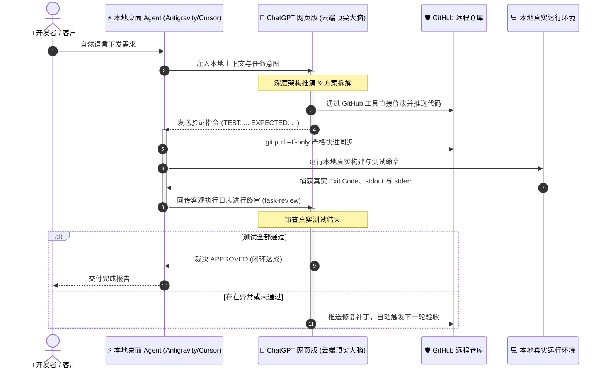

<div align="center">

# 🤖 Antigravity2gptweb
### 纯自然语言驱动的通用“双脑”AI 协作开发桥梁
**Desktop Agent × ChatGPT 网页版 (o1 / o3 / 4o) × GitHub 全自动闭环**

<br/>

[](LICENSE)
[](https://github.com/yvochehk-oss/Antigravity2gptweb/releases/latest)
[](#-极速下载与安装包无需命令行)
[](#-平台支持与跨平台安装)
[](#-安装到-antigravity-ide)
[](#-双脑协作架构与执行时序)
[](#-安全合规与隐私保障)
[](https://github.com/users/yvochehk-oss/projects/2/views/1)
[](https://github.com/yvochehk-oss/Antigravity2gptweb)

<br/>

<p align="center">
  <a href="#-极速下载与安装包无需命令行">极速下载</a> •
  <a href="#-核心价值与痛点解决">核心价值</a> •
  <a href="#-双脑协作架构与执行时序">架构原理</a> •
  <a href="#-平台支持与跨平台安装">跨平台安装</a> •
  <a href="#-安装到-antigravity-ide">Antigravity 集成</a> •
  <a href="#-安全合规与隐私保障">安全保障</a> •
  <a href="#-实时研发看板-live-roadmap">项目看板</a> •
  <a href="#-开源协议与支持">Star 支持</a>
</p>

</div>

---

> **一句话愿景**：告别在网页端与代码编辑器之间繁琐的“复制、粘贴、运行、报错、再复制”。你只需在聊天框里用平常说话的自然语言描述需求，桌面 AI Agent 即可自动直连 ChatGPT 网页端顶尖大模型（o1 / o3 / 4o），完成**云端架构推演、GitHub 远端修改提交、本地确定性快速拉取与闭环测试验收**！

---

## 📥 极速下载与安装包（无需命令行）

针对不习惯使用 Git 终端命令行的客户与用户，我们提供了预打包的绿色 ZIP 安装包，点击即可直接下载：

| 平台通道 | 一键直链下载 | 包含组件与特性 |
| :--- | :--- | :--- |
| 🍏 **macOS 专版** | [**📥 下载 Antigravity2gptweb-macos.zip**](https://github.com/yvochehk-oss/Antigravity2gptweb/archive/refs/heads/macos.zip) | Safari 原生驱动、Python CDP 桥接与完整任务编排套件 |
| 🪟 **Windows 专版** | [**📥 下载 Antigravity2gptweb-windows.zip**](https://github.com/yvochehk-oss/Antigravity2gptweb/archive/refs/heads/windows.zip) | 纯原生 Node.js 18+ 驱动引擎（**0 个 npm 依赖**）、Edge/Chrome 支持 |
| 📦 **官方 Release** | [**🏷️ 前往 Releases v1.0.0 官方发行页**](https://github.com/yvochehk-oss/Antigravity2gptweb/releases/tag/v1.0.0) | 官方版本发行说明、源代码与校验 Hash |

---

## 💡 核心价值与痛点解决

过去使用 AI 辅助软件开发或交付项目时，经常面临效率瓶颈：
- 🤯 **思路卡壳 / 架构复杂**：遇到疑难复杂问题不知道如何拆解，需要顶级的深度思考模型（如 o1 / o3-mini / GPT-4o）来全局指导。
- 😫 **频繁复制极其痛苦**：在 ChatGPT 网页端和本地编辑器之间来回“复制、粘贴、运行、报错、再发回提问”，费时费力且容易出错。
- 💸 **API 账单居高不下**：调用外部 API 不仅上下文计费昂贵，还经常受限于速率上限（Rate Limits）。
- 😨 **改动失控难以挽回**：AI 一次性修改了多个文件导致项目跑不通，找不到原始版本，不知如何优雅回滚。

### 痛点对比一览表

| 维度 | 传统手工 / 纯本地 AI 模式 | 🤖 Antigravity2gptweb 双脑协作模式 |
| :--- | :--- | :--- |
| **交互方式** | 手动在网页与 IDE 间来回搬运代码 | **纯自然语言下发**，全流程自动化闭环 |
| **推理成本** | 昂贵的商业 API 计费、Token 消耗极快 | **零额外 API 成本**，充分复用已有的 ChatGPT Plus/Team 网页订阅 |
| **代码可靠性** | 本地模型经常“幻觉伪造”，改完报错 | **严格闭环验收**：本地真实跑测，GPT 裁决 `APPROVED` 方可交付 |
| **版本安全** | 容易直接覆盖本地代码，改错无法恢复 | **GitHub 严格护栏**：强制原子化提交与 Fast-Forward，随时一键回滚 |

---

## 👥 双脑协作架构与执行时序

本项目采用创新的 **双平面隔离架构 (Dual-Plane Architecture)**：将“思考与代码修改权”交给云端大模型，将“确定性测试与客观证据收集”交给本地桌面环境。

### 协作流程图



### 角色分工与执行铁律

| 角色 | 核心职责 | 行为边界（严禁越位） | 带来的好处 |
| :--- | :--- | :--- | :--- |
| 🧠 **ChatGPT 网页版**<br>*(云端总架构师)* | 负责深度逻辑推演、方案拆解、**通过 GitHub 工具修改、提交和推送业务代码**、提供测试命令与审核测试结果 | 仅操作用户授权的远程仓库与分支，独占方案与代码修改权 | 借助网页端顶尖推理能力，保证全局架构与业务代码的高水准 |
| ⚡ **本地桌面 Agent**<br>*(精准验收执行端)* | 负责提取环境上下文、`git pull --ff-only` 同步远端提交、运行真实测试命令、将测试日志回传 GPT 审查 | **严禁越俎代庖编写或覆盖本地业务代码**；工作区有未提交变动时必须停止同步 | 用真实环境提供可复核的客观证据，彻底杜绝 AI 幻觉和瞎编 |
| 🛡️ **GitHub 仓库**<br>*(版本安全管家)* | 自动记录每一次变动，保留完整历史 | 任何一次改动都具备原子化 Commit，改错了随时一键撤销 | 历史透明可追溯，保障企业级代码资产绝对安全 |

---

## 📦 平台支持与跨平台安装

本项目采用**平台专项分支发布**模式：`main` 分支作为公开统一门面；macOS 与 Windows 分别拥有专属优化分支，用户无需安装任何臃肿庞大的第三方依赖包。

| 平台 | 分支 | 运行时要求 | 浏览器驱动通道 | 特性优势 |
| :--- | :--- | :--- | :--- | :--- |
| **macOS** | [`macos`](https://github.com/yvochehk-oss/Antigravity2gptweb/tree/macos) | Python 3 | Safari AppleScript（原生零依赖）/ Chrome CDP | 原生无感驱动、支持复杂任务多轮编排与方案 Refine |
| **Windows 10/11** | [`windows`](https://github.com/yvochehk-oss/Antigravity2gptweb/tree/windows) | Node.js 18+ | Microsoft Edge / Chrome CDP | 纯原生 Node.js 实现，**0 个 npm 依赖包**，启动飞快 |

### 独立终端快速运行

#### 🍎 macOS 快速启动
```bash
git clone --depth 1 --branch macos https://github.com/yvochehk-oss/Antigravity2gptweb.git chatgpt-web-reasoner
cd chatgpt-web-reasoner
python3 scripts/safari_chatgpt.py --help
```

#### 🪟 Windows 快速启动
```powershell
git clone --depth 1 --branch windows https://github.com/yvochehk-oss/Antigravity2gptweb.git chatgpt-web-reasoner
cd chatgpt-web-reasoner
.\check_env_windows.bat
.\start_edge_cdp.bat
```

---

## 🚀 安装到 Antigravity IDE

本项目支持一键作为 Skill 挂载至 Google Antigravity IDE 或其他桌面 Agent 环境：

### 1. 全局安装（所有本地项目通用）

* **macOS**：
  ```bash
  mkdir -p ~/.gemini/antigravity/skills
  git clone --branch macos --single-branch \
    https://github.com/yvochehk-oss/Antigravity2gptweb.git \
    ~/.gemini/antigravity/skills/safari-chatgpt-reasoner
  ```

* **Windows PowerShell**：
  ```powershell
  New-Item -ItemType Directory -Force "$env:USERPROFILE\.gemini\antigravity\skills" | Out-Null
  git clone --branch windows --single-branch https://github.com/yvochehk-oss/Antigravity2gptweb.git "$env:USERPROFILE\.gemini\antigravity\skills\safari-chatgpt-reasoner"
  ```

### 2. 项目级安装（随项目团队代码库分发）

在项目的根目录下执行：
```bash
mkdir -p .agent/skills
git clone --branch macos --single-branch \
  https://github.com/yvochehk-oss/Antigravity2gptweb.git \
  .agent/skills/safari-chatgpt-reasoner
```
*(Windows 用户只需将上述命令中的 `macos` 替换为 `windows`)*

### 3. 一键更新
```bash
git -C ~/.gemini/antigravity/skills/safari-chatgpt-reasoner pull --ff-only
```

---

## 🛡️ 安全合规与隐私保障

1. **自动敏感凭据脱敏**：
   内置自动化安全正则扫描引擎，所有提交与回传日志中的 API Key（如 `sk-...`）、授权 Token 会被自动转换为掩码（`[OPENAI_KEY]`），确保任何敏感凭据绝不泄露到网络中。
2. **严格 Fast-Forward 防覆盖机制**：
   本地只允许 `git pull --ff-only` 操作。一旦检测到本地有未提交的改动或冲突，程序立即安全熔断，绝不强制覆盖开发者已写好的任何业务代码。
3. **完全所有权**：
   用户始终拥有对 GitHub 仓库与本地运行环境的绝对控制权，代码只存储在您的 GitHub 账户与本地机器中。

---

## 📊 实时研发看板 (Live Roadmap)

为了让客户和使用者清晰了解项目的迭代动态，我们设立了公开的实时项目看板：

👉 **[点击访问 GitHub Project 2 实时交付看板](https://github.com/users/yvochehk-oss/projects/2/views/1)**

| 阶段 | 交付目标 | 状态 |
| :--- | :--- | :--- |
| **Q3 核心闭环** | Safari & Edge/Chrome 双向自动化桥接与任务审查协议 | `✅ 已发布 (Done)` |
| **Q3 跨平台** | Windows 零 npm 依赖 Node.js CDP 原生引擎 | `✅ 已发布 (Done)` |
| **Q4 体验增强** | 多浏览器自动探测与端口智能动态适配 | `🚀 进行中 (In Progress)` |
| **Q4 开放生态** | 针对企业私有知识库与多仓库协作支持 | `📋 规划中 (Backlog)` |

---

## 🤝 反馈与参与贡献

欢迎通过 GitHub 提交反馈与需求：
* 遇到异常或 Bug：欢迎提交 [Bug Report](https://github.com/yvochehk-oss/Antigravity2gptweb/issues/new?template=bug_report.md)
* 新增功能建议：欢迎提交 [Feature Request](https://github.com/yvochehk-oss/Antigravity2gptweb/issues/new?template=feature_request.md)
* 安全漏洞通报：请查阅 [SECURITY.md](SECURITY.md)

---

## ⭐ 开源协议与支持

本项目基于 [MIT License](LICENSE) 开源。

如果本项目为您的日常开发与 AI 协作带来了帮助与启发，欢迎在 GitHub 右上角为我们点亮一颗 **⭐ Star**！您的支持是项目持续迭代的最大动力！
