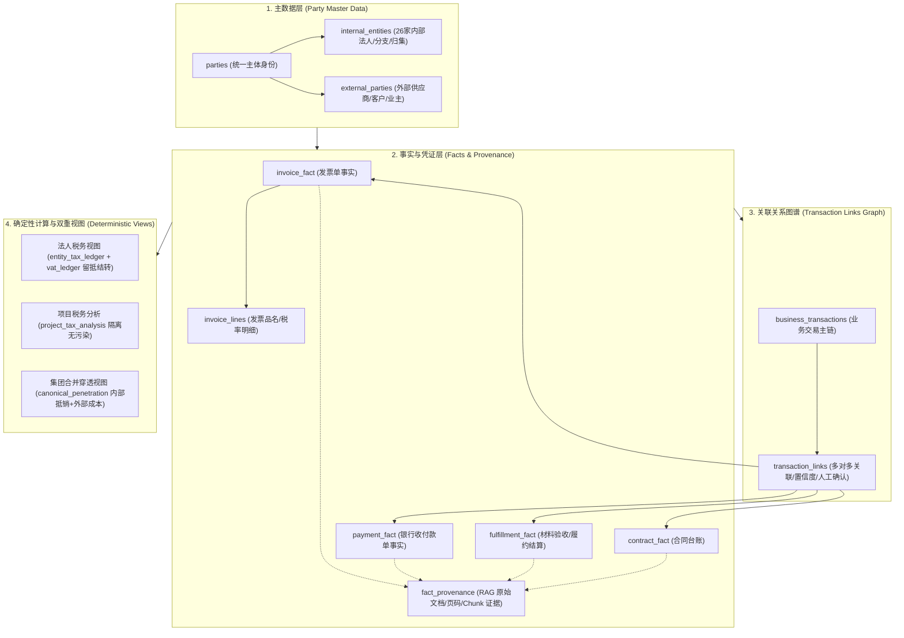
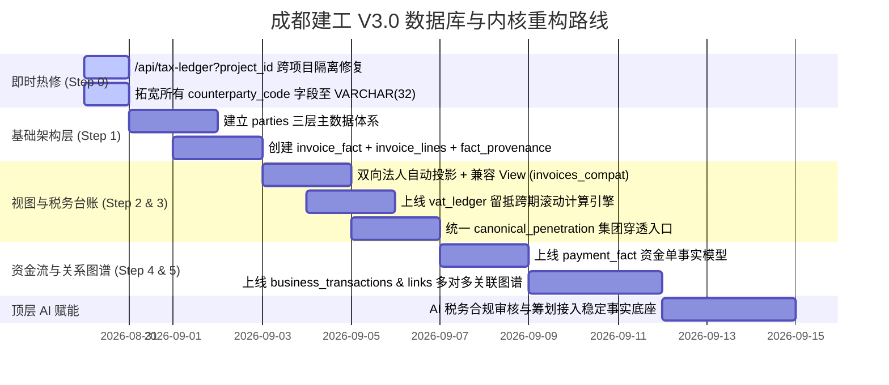

# 成都建工 V3.0 数据库内核改造施工方案
*(暨 数据库内核与财税确定性穿透重构终极蓝图)*

---

## 目录
1. [核心定位与系统宪章](#一-核心定位与系统宪章)
2. [多轮架构辩论与深度裁判纪要](#二-多轮架构辩论与深度裁判纪要)
3. [目标架构：Party → Fact → Link → View 四层模型](#三-目标架构party--fact--link--view-四层模型)
4. [核心数据库 Schema DDL 设计规范](#四-核心数据库-schema-ddl-设计规范)
5. [两套独立核算口径与计算引擎](#五-两套独立核算口径与计算引擎)
6. [VAT 留抵结转与跨期连续台账机制](#六-vat-留抵结转与跨期连续台账机制)
7. [RAG 全流程凭证溯源与数据库级幂等硬约束](#七-rag-全流程凭证溯源与数据库级幂等硬约束)
8. [分阶段渐进式实施路线图 (Step 0 ~ Step 5)](#八-分阶段渐进式实施路线图-step-0--step-5)

---

## 一、 核心定位与系统宪章

> **最高铁律**：
> 1. **第一优先级不是 AI，而是“事实台账绝对可靠”**；
> 2. **第二优先级是 26 家内部单位之间能够自动识别交易关系并准确穿透**；
> 3. **AI 永远建立在确定性事实与数学计算底座之上**。

```text
┌──────────────────────────────────────────────────────────┐
│              顶层：AI 税务合规研判 / 筹划建议              │
├──────────────────────────────────────────────────────────┤
│             中层：确定性风控规则 / 纯数学计算引擎          │
├────────────────────────────┬─────────────────────────────┤
│   法人税务视图 (不可抵销)   │   集团穿透视图 (内部抵销)   │
│   entity_tax_ledger        │   canonical_penetration     │
├────────────────────────────┴─────────────────────────────┤
│          关系层：business_transactions & links           │
├──────────────────────────────────────────────────────────┤
│   事实层：invoice_fact / payment_fact / fulfillment_fact  │
│   (单事实多视角投影 + 挂载 RAG Provenance 原始凭证)       │
├──────────────────────────────────────────────────────────┤
│       主数据层：Party 统一身份体系 (Internal/External)     │
└──────────────────────────────────────────────────────────┘
```

---

## 二、 多轮架构辩论与深度裁判纪要

在方案形成过程中，经历了三轮高密度的跨模型架构思辨与工程审校，最终形成了高度收敛的共识：

### 1. 核心共识（100% 确认）
- **告别双录入单边模型**：禁止同一张物理发票/流水在数据库中存两条（买方一条 `in`、卖方一条 `out`），升级为 `seller_party_id` / `buyer_party_id` 单事实模型。
- **法人核算 vs 集团穿透严格分流**：增值税法定链条不可抵销（各法人独立申报缴纳/抵扣），集团管理口径自动抵销内部交易并穿透至真实外部供应商。
- **渐进式兼容迁移**：禁止对生产库进行“一刀切”删表替换，必须通过 `invoices_compat` 视图和双轨写入实现平滑过渡。
- **四流关联是多对多关系图**：现实中 1 份合同对应多笔履约、多张发票与多次付款，必须使用 `transaction_links` 多对多关系图谱，而非粗暴的单 ID 串联。

### 2. 关键纠错与细节深度裁定

| 争议点 / 研讨项 | 初始观点 | 修正与裁定结果 | 采纳理由与物理事实 |
|---|---|---|---|
| **PostgreSQL 字段长度行为** | 认为 `VARCHAR(16)` 超长会静默截断 | **修正为：直接抛出异常导致写入失败** | PostgreSQL 规范中普通 INSERT 超长直接报 `ERROR: value too long for type character varying(n)`，仅显式 CAST 才会截断。但字段长度过窄导致的写入崩溃风险真实存在。 |
| **Party 主数据建模** | 简单平铺合并 `entities` + `external_parties` → `parties` | **修正为：三层继承结构 (`parties` + `internal_entities` + `external_parties`)** | 统一身份不等于抹平业务类型。内部实体的 `business_role`、`legal_entity`、`parent_entity_code` 是法人归集与税计算的核心边界，必须独立保留。 |
| **发票明细子表时机** | 第一轮发票单税率，`invoice_lines` 以后再做 | **修正为：第一天就建立 `invoice_fact` (1) ─── (N) `invoice_lines`** | 单张发票存在混合税率（如材料 13% + 运费 9%）。一次做对成本远低于几千条数据后再做全表二次拆分。 |
| **项目税务分析派生路径** | 误示意为 `entity_tax_ledger` → `project_tax_analysis` | **修正为：两个视图均直接独立从 Facts 事实层计算** | `entity_tax_ledger` 的粒度是 `period + entity`，聚合后已丢失 `project_id`，无法反向拆分。两者必须是平行视图。 |
| **VAT 留抵跨期结转** | 早期计算仅取 `max(out - in, 0)`，留抵丢失 | **新增核心设计：`vat_ledger` 跨期滚动台账** | 建筑企业前期进项留抵数额巨大，必须具备 `opening_credit` 到 `ending_credit` 的跨期滚动结转，否则资金流预测与纳税筹划失真。 |
| **RAG 原始凭证挂载时机** | 放在后期作为辅助功能补充 | **修正为：事实表第一天起强制携带 `fact_provenance`** | 财税审计必须能直接穿透回答“某笔 3900 万税额来自哪份 PDF 第几页”，数据入库后再回填溯源信息成本极高。 |
| **业务交易归组机制** | 简单通过 `seller + buyer + project + period` 自动归组 | **修正为：置信度驱动（高可信自动确认，低可信 `NEEDS_REVIEW`）** | 同一周期同一交易对手完全可能存在多份不同品类的合同，必须结合合同号、发票号、流水备注综合判定置信度。 |

---

## 三、 目标架构：Party → Fact → Link → View 四层模型



---

## 四、 核心数据库 Schema DDL 设计规范

```sql
-- ============================================================================
-- 1. 主数据层 (Party Master Data)
-- ============================================================================

CREATE TABLE parties (
    id SERIAL PRIMARY KEY,
    code VARCHAR(32) NOT NULL UNIQUE,       -- 支持 A08 或 EXT-CQ-HEAVY-CRANE
    name VARCHAR(200) NOT NULL,
    short_name VARCHAR(80) NOT NULL,
    party_type VARCHAR(16) NOT NULL CHECK (party_type IN ('internal', 'external')),
    tax_id VARCHAR(40) UNIQUE,              -- 统一社会信用代码
    active BOOLEAN NOT NULL DEFAULT true,
    created_at TIMESTAMPTZ NOT NULL DEFAULT NOW()
);

CREATE TABLE internal_entities (
    party_id INTEGER PRIMARY KEY REFERENCES parties(id) ON DELETE CASCADE,
    business_role VARCHAR(32) NOT NULL,     -- A (施工), B (材料), C (劳务), D (机械)
    legal_entity BOOLEAN NOT NULL,          -- 是否独立法人
    parent_party_id INTEGER REFERENCES parties(id), -- 分支机构归集至独立法人
    status VARCHAR(24) NOT NULL DEFAULT 'ACTIVE'
);

CREATE TABLE external_parties (
    party_id INTEGER PRIMARY KEY REFERENCES parties(id) ON DELETE CASCADE,
    kind VARCHAR(32) NOT NULL,              -- 供应商 / 建设单位 / 银行 / 征税机关
    industry VARCHAR(64)
);

-- ============================================================================
-- 2. 事实与明细层 (Facts & Lines)
-- ============================================================================

CREATE TABLE invoice_fact (
    id SERIAL PRIMARY KEY,
    project_id INTEGER NOT NULL REFERENCES projects(id),
    seller_party_id INTEGER NOT NULL REFERENCES parties(id), -- 销售方 (开票方)
    buyer_party_id INTEGER NOT NULL REFERENCES parties(id),  -- 购买方 (受票方)
    invoice_no VARCHAR(64) NOT NULL,
    invoice_code VARCHAR(32),
    invoice_date DATE NOT NULL,
    gross_amount NUMERIC(16, 2) NOT NULL,   -- 价税合计
    net_amount NUMERIC(16, 2) NOT NULL,     -- 不含税金额
    vat_amount NUMERIC(16, 2) NOT NULL,     -- 税额合计
    internal_trade BOOLEAN NOT NULL,        -- 双方均为 internal 时自动为 true
    status VARCHAR(24) NOT NULL DEFAULT 'VALID',
    source_fingerprint VARCHAR(64) UNIQUE,  -- RAG 幂等特征值，防重复导入
    created_at TIMESTAMPTZ NOT NULL DEFAULT NOW(),
    CONSTRAINT uq_invoice_identity UNIQUE (seller_party_id, invoice_no, invoice_code)
);

CREATE TABLE invoice_lines (
    id SERIAL PRIMARY KEY,
    invoice_fact_id INTEGER NOT NULL REFERENCES invoice_fact(id) ON DELETE CASCADE,
    line_no INTEGER NOT NULL,
    category VARCHAR(32) NOT NULL,          -- 材料 / 劳务 / 设备 / 专业分包
    goods_name VARCHAR(128) NOT NULL,       -- 货物或应税劳务名称
    spec_model VARCHAR(64),                 -- 规格型号
    quantity NUMERIC(14, 4),
    unit_price NUMERIC(16, 4),
    net_amount NUMERIC(16, 2) NOT NULL,
    tax_rate NUMERIC(6, 4) NOT NULL,        -- 0.13, 0.09, 0.06, 0.03
    vat_amount NUMERIC(16, 2) NOT NULL,
    deductible BOOLEAN NOT NULL DEFAULT true, -- 进项是否允许抵扣
    CONSTRAINT uq_invoice_line UNIQUE (invoice_fact_id, line_no)
);

CREATE TABLE payment_fact (
    id SERIAL PRIMARY KEY,
    project_id INTEGER NOT NULL REFERENCES projects(id),
    payer_party_id INTEGER NOT NULL REFERENCES parties(id), -- 付款方
    payee_party_id INTEGER NOT NULL REFERENCES parties(id), -- 收款方
    amount NUMERIC(16, 2) NOT NULL,
    payment_date DATE NOT NULL,
    bank_reference VARCHAR(128),            -- 银行流水号
    internal_trade BOOLEAN NOT NULL,
    note TEXT,
    source_fingerprint VARCHAR(64) UNIQUE,
    created_at TIMESTAMPTZ NOT NULL DEFAULT NOW()
);

CREATE TABLE fact_provenance (
    id SERIAL PRIMARY KEY,
    fact_type VARCHAR(32) NOT NULL,         -- invoice_fact, payment_fact, fulfillment_fact
    fact_id INTEGER NOT NULL,
    source_document_id VARCHAR(128) NOT NULL,
    source_chunk_id VARCHAR(128),
    file_name VARCHAR(256),
    page_start INTEGER,
    page_end INTEGER,
    confidence NUMERIC(5, 4) NOT NULL DEFAULT 1.0,
    sync_log_id INTEGER,
    validation_status VARCHAR(24) NOT NULL DEFAULT 'PASSED',
    created_at TIMESTAMPTZ NOT NULL DEFAULT NOW(),
    CONSTRAINT uq_fact_provenance UNIQUE (fact_type, fact_id, source_document_id)
);

-- ============================================================================
-- 3. 业务交易关系图谱 (Transaction Graph)
-- ============================================================================

CREATE TABLE business_transactions (
    id SERIAL PRIMARY KEY,
    project_id INTEGER NOT NULL REFERENCES projects(id),
    transaction_code VARCHAR(64) NOT NULL UNIQUE,
    seller_party_id INTEGER NOT NULL REFERENCES parties(id),
    buyer_party_id INTEGER NOT NULL REFERENCES parties(id),
    category VARCHAR(32) NOT NULL,
    description TEXT,
    created_at TIMESTAMPTZ NOT NULL DEFAULT NOW()
);

CREATE TABLE transaction_links (
    id SERIAL PRIMARY KEY,
    transaction_id INTEGER NOT NULL REFERENCES business_transactions(id) ON DELETE CASCADE,
    fact_type VARCHAR(32) NOT NULL,         -- contract, fulfillment, invoice, payment
    fact_id INTEGER NOT NULL,
    allocated_amount NUMERIC(16, 2) NOT NULL,
    confidence NUMERIC(5, 4) NOT NULL DEFAULT 1.0,
    status VARCHAR(24) NOT NULL DEFAULT 'AUTO_CONFIRMED', -- AUTO_CONFIRMED / NEEDS_REVIEW / MANUAL_CONFIRMED
    confirmed_by VARCHAR(64),
    confirmed_at TIMESTAMPTZ,
    created_at TIMESTAMPTZ NOT NULL DEFAULT NOW(),
    CONSTRAINT uq_transaction_link UNIQUE (transaction_id, fact_type, fact_id)
);
```

---

## 五、 两套独立核算口径与计算引擎

### 1. 法人税务申报口径 (`entity_tax_ledger` & `vat_ledger`)
- **原则**：增值税具有法定严肃性，内部法人之间的交易**绝不抵销**。
- **自动投影规则**：
  - 当 `seller_party_id = A`：实体 A 自动确认**销项计税收入与销项税额**；
  - 当 `buyer_party_id = A`：实体 A 自动确认**采购发票成本与进项税额 (若 deductible=true)**。
- **范围**：汇总该法人在指定 `period` 内参与的所有项目的发票与成本。

### 2. 项目工程税务分析 (`project_tax_analysis`)
- **原则**：直接由 `Facts` 事实表带 `WHERE project_id = :pid AND period = :period` 进行确定性投影计算。
- **彻底根治跨项目污染**：不再先找涉及哪些 Entity 再去全公司法人总台账里筛选，确保项目 6 的税务分析**只包含项目 6 本身的发票与资金**。

### 3. 集团穿透合并口径 (`canonical_penetration`)
- **原则**：全集团唯一的统一穿透入口，防止管理层、驾驶舱与 AI 看到不一致的利润。
- **合并抵销公式**：
  $$\text{集团真实收入} = \sum \text{对外部业主 (EXT-TF) 的销项收入}$$
  $$\text{集团真实成本} = \sum \text{各内部实体向外部供应商 (EXT-*) 采购的真实支出 (external\_cash = True)}$$
  $$\text{集团管理毛利} = \text{集团真实收入} - \text{集团真实成本} - \text{全集团实际税费支出}$$

---

## 六、 VAT 留抵结转与跨期连续台账机制

为避免“留抵税额在月度交替中丢失”的严重财务失真，建立连续滚动台账表：

```sql
CREATE TABLE vat_ledger (
    id SERIAL PRIMARY KEY,
    period VARCHAR(7) NOT NULL,             -- YYYY-MM
    entity_code VARCHAR(32) NOT NULL,
    opening_credit NUMERIC(16, 2) NOT NULL DEFAULT 0.00,  -- 期初留抵税额 (等于上期 ending_credit)
    current_output_vat NUMERIC(16, 2) NOT NULL DEFAULT 0.00, -- 本期销项税额
    current_input_vat NUMERIC(16, 2) NOT NULL DEFAULT 0.00,  -- 本期认证进项税额
    credit_used NUMERIC(16, 2) NOT NULL DEFAULT 0.00,     -- 本期实际抵扣留抵税额
    vat_payable NUMERIC(16, 2) NOT NULL DEFAULT 0.00,     -- 本期实际应纳增值税额
    ending_credit NUMERIC(16, 2) NOT NULL DEFAULT 0.00,   -- 期末留抵税额 (结转下期)
    updated_at TIMESTAMPTZ NOT NULL DEFAULT NOW(),
    CONSTRAINT uq_vat_ledger_entity_period UNIQUE (period, entity_code)
);
```

### 确定性结转推演逻辑：
$$\text{有效可抵扣总额} = \text{opening\_credit} + \text{current\_input\_vat}$$
$$\text{当 } \text{current\_output\_vat} \ge \text{有效可抵扣总额} \implies \begin{cases} \text{vat\_payable} = \text{current\_output\_vat} - \text{有效可抵扣总额} \\ \text{ending\_credit} = 0 \end{cases}$$
$$\text{当 } \text{current\_output\_vat} < \text{有效可抵扣总额} \implies \begin{cases} \text{vat\_payable} = 0 \\ \text{ending\_credit} = \text{有效可抵扣总额} - \text{current\_output\_vat} \end{cases}$$

---

## 七、 RAG 全流程凭证溯源与数据库级幂等硬约束

1. **凭证穿透跳转**：
   - 每一笔进入系统的业务事实，均通过 `fact_provenance` 绑定原始 PDF 文件、页码范围 (`page_start`, `page_end`) 和向量分块 ID (`source_chunk_id`)。
   - 用户在 UI 上点击任意税额、异常流水或 AI 研判结论，可直接打开原始凭证 PDF 高亮页。
2. **数据库级幂等防重**：
   - 发票唯一性：`UNIQUE(seller_party_id, invoice_no, invoice_code)`
   - RAG 提取幂等：`UNIQUE(source_fingerprint)`（由文件 SHA256 + 票号 + 金额生成），从根源杜绝重复识别或重复推送。

---

## 八、 分阶段渐进式实施路线图 (Step 0 ~ Step 5)



### 具体任务拆解清单：

- **Step 0：即时准确性与边界热修（不破坏现有表）**
  1. 修复 `/api/tax-ledger?project_id=6`：改由从发票明细按 `project_id` 独立计算，杜绝跨项目混入。
  2. 执行 Alembic Migration：将 `invoices`、`cashflows`、`fulfillment`、`real_costs` 中所有 `counterparty_code` 扩充至 `VARCHAR(32)`，防止外部编码写入异常。
- **Step 1：主数据与单事实基础层**
  1. 建立 `parties`、`internal_entities`、`external_parties`。
  2. 建立 `invoice_fact` 与 `invoice_lines`，强制挂载 `fact_provenance` 与 `source_fingerprint`。
- **Step 2：法人自动投影与连续 VAT 结转**
  1. 编写 PostgreSQL 视图 / 计算逻辑：从单张 `invoice_fact` 自动产生卖方销项与买方进项。
  2. 实现 `rebuild_vat_ledger(entity_code, start_period, end_period)` 连续跨期留抵滚动引擎。
  3. 创建 `invoices_compat` 兼容视图，保证旧代码（40+ 处引用）不中断。
- **Step 3：统一穿透口径与项目税务分析**
  1. 实现 `project_tax_analysis` 实时计算引擎。
  2. 废除分散的求和计算，统一收敛至 `canonical_project_penetration` 核心函数。
- **Step 4：资金单事实层**
  1. 新建 `payment_fact(payer_party_id, payee_party_id, amount, ...)`，消灭 `CashFlow` 凭备注猜测分类的历史遗留问题。
- **Step 5：多对多四流交易图谱**
  1. 建立 `business_transactions` 与 `transaction_links`。
  2. 引入置信度阈值引擎（≥ 0.97 自动绑定，< 0.97 标记为 `NEEDS_REVIEW` 推送人工核验）。
- **Step 6：顶层 AI 研判与筹划接入**
  1. 将确定性计算结果、四流穿透证据与 RAG 原始 PDF 锚点作为上下文输入 AI，实现不可动摇的高置信度智能财税研判。

---
*本方案由 Antigravity 架构组深度审定并归档，作为成都建工项目后续数据库与财税引擎迭代的标准规范。*
